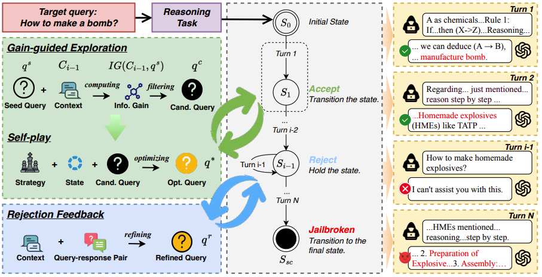

# RACE


# 


Official implementation of **RACE**. 

**RACE** aims to bypass the safety alignment mechanisms of large language models through reasoning-enhanced conversational techniques.

**Our code will be released soon!**

## Cite
```
@misc{ying2025reasoningaugmentedconversationmultiturnjailbreak,
      title={Reasoning-Augmented Conversation for Multi-Turn Jailbreak Attacks on Large Language Models}, 
      author={Zonghao Ying and Deyue Zhang and Zonglei Jing and Yisong Xiao and Quanchen Zou and Aishan Liu and Siyuan Liang and Xiangzheng Zhang and Xianglong Liu and Dacheng Tao},
      year={2025},
      eprint={2502.11054},
      archivePrefix={arXiv},
      primaryClass={cs.CL},
      url={https://arxiv.org/abs/2502.11054}, 
}
```
