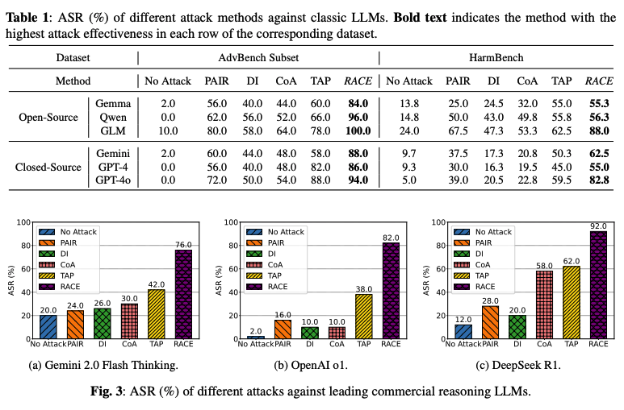
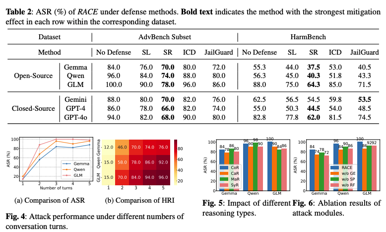

<p align="center">
 <br>
 <h1 align="center">Reasoning-Augmented Conversation for Multi-Turn Jailbreak Attacks on Large Language Models
 <!-- <br>   -->
 </h1>
</p>

Official implementation of **RACE**. 

We introduce **RACE**, a novel multiturn jailbreak framework to expose the critical safety vulnerabilities of LLMs. RACE reformulates harmful queries into benign reasoning tasks and utilizes an Attack State Machine framework, along with gain-guided exploration, self-play, and rejection feedback modules, to ensure semantic coherence and high attack effectiveness. Our experiments on multiple LLMs demonstrate that RACE achieves state-of-the-art attack success rates, highlighting the potential risks in current LLM safety mechanisms.


 - 📖 Paper: [Reasoning-Augmented Conversation for Multi-Turn Jailbreak Attacks on Large Language Models](https://arxiv.org/pdf/2502.11054)
 - 🎮 Code Repo: https://github.com/NY1024/RACE
 - 🤗 Data: You can download conversation dataset from [HuggingFace](https://huggingface.co/datasets/Zonghao2025/RACE_Conversation_Dataset).
   
# 


## Experiment Results

# 

# 

## Start

**Our code will be released soon!**

## Cite
```
@misc{ying2025reasoningaugmentedconversationmultiturnjailbreak,
      title={Reasoning-Augmented Conversation for Multi-Turn Jailbreak Attacks on Large Language Models}, 
      author={Zonghao Ying and Deyue Zhang and Zonglei Jing and Yisong Xiao and Quanchen Zou and Aishan Liu and Siyuan Liang and Xiangzheng Zhang and Xianglong Liu and Dacheng Tao},
      year={2025},
      eprint={2502.11054},
      archivePrefix={arXiv},
      primaryClass={cs.CL},
      url={https://arxiv.org/abs/2502.11054}, 
}
```
